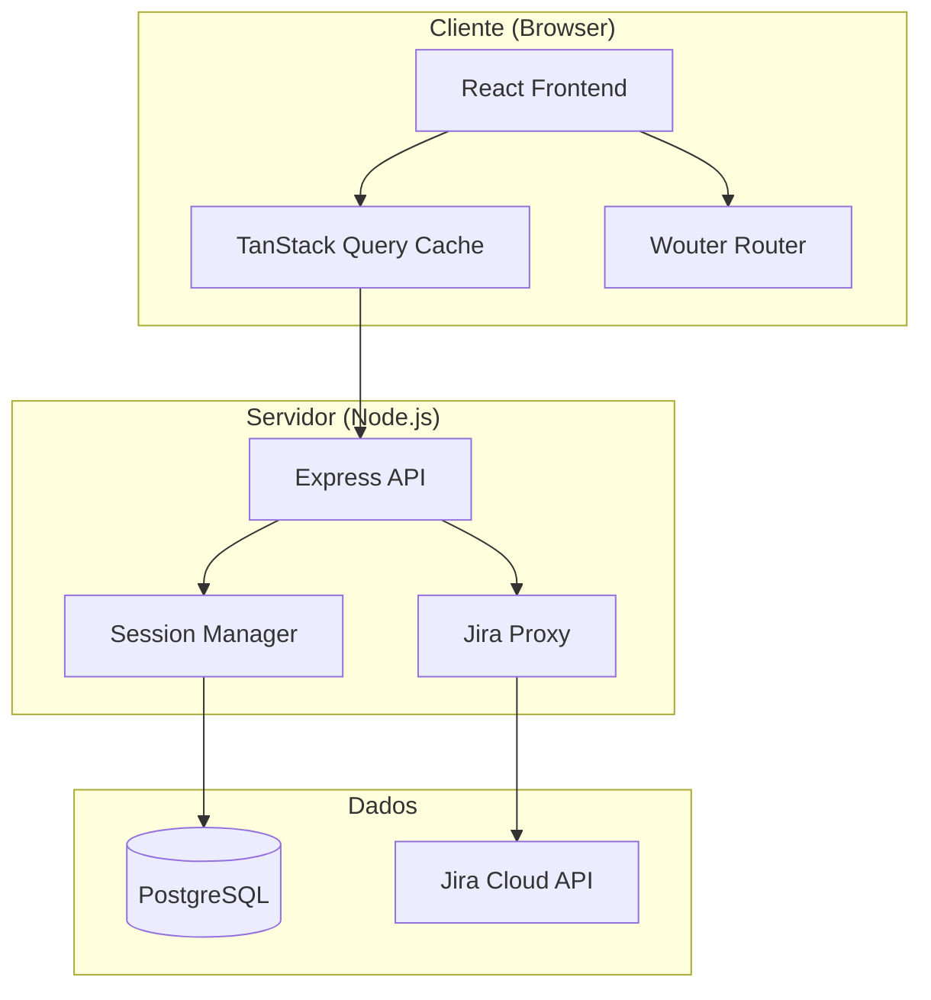
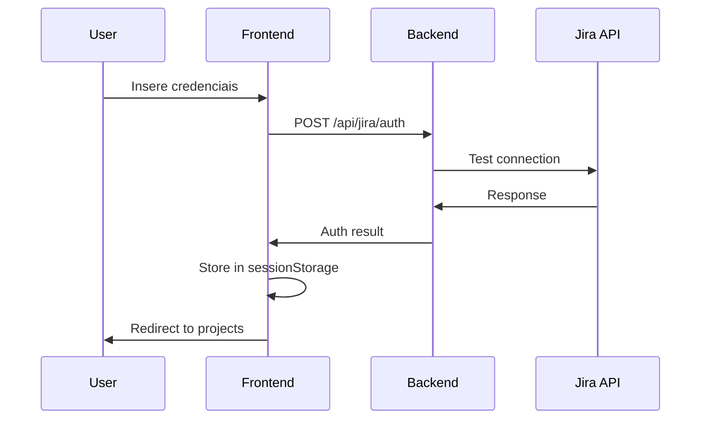
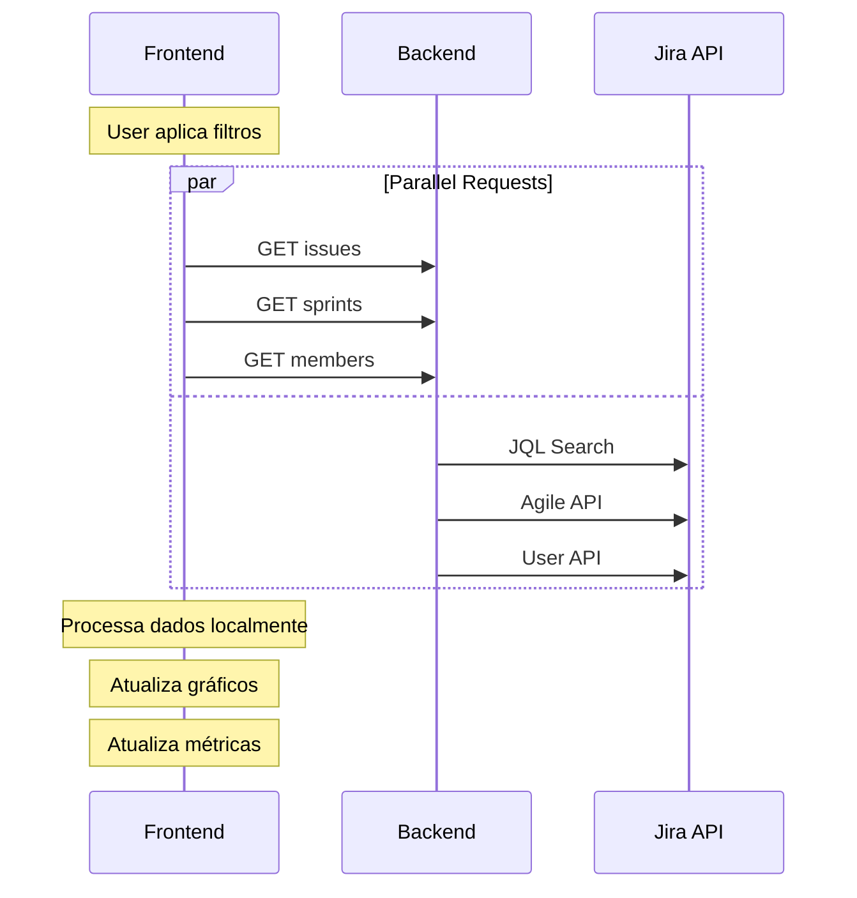

# Arquitetura do Sistema
## Jira Productivity Dashboard

### 🏛️ **Visão Geral da Arquitetura**



---

## 📁 **Estrutura de Diretórios**

```
projeto/
├── client/                  # Frontend React
│   ├── src/
│   │   ├── components/      # Componentes React
│   │   │   ├── ui/         # Componentes base (shadcn)
│   │   │   ├── charts/     # Gráficos específicos
│   │   │   └── *.tsx       # Componentes de negócio
│   │   ├── hooks/          # Custom hooks
│   │   ├── lib/            # Utilitários e configurações
│   │   ├── pages/          # Páginas da aplicação
│   │   ├── types/          # Definições TypeScript
│   │   └── main.tsx        # Entry point
│   └── public/             # Assets estáticos
├── server/                 # Backend Express
│   ├── index.ts           # Servidor principal
│   ├── routes.ts          # Rotas da API
│   ├── storage.ts         # Camada de dados
│   └── vite.ts            # Integração Vite
├── shared/                # Código compartilhado
│   └── schema.ts          # Schemas Drizzle + Zod
├── docs/                  # Documentação
└── config files           # Configurações do projeto
```

---

## 🎯 **Camada Frontend (Client)**

### **Arquitetura de Componentes**

```
App.tsx
├── Router (Wouter)
├── AuthProvider
├── QueryClient Provider
└── Pages
    ├── LoginPage
    ├── ProjectSelectionPage
    ├── DashboardPage
    │   ├── Header
    │   ├── Sidebar (Filtros)
    │   ├── MetricsCards
    │   ├── CompletionCharts
    │   └── Footer
    └── KanbanPage
        ├── Header
        ├── Sidebar (Filtros)
        ├── KanbanBoard
        └── Footer
```

### **Padrões de Design**

#### **1. Composição de Componentes**
```typescript
// Componente principal
export function Dashboard() {
  return (
    <div className="dashboard">
      <Header />
      <main className="flex">
        <Sidebar />
        <MainContent />
      </main>
      <Footer />
    </div>
  );
}

// Componentes especializados
const MainContent = () => (
  <section className="flex-1">
    <MetricsGrid />
    <ChartsSection />
  </section>
);
```

#### **2. Custom Hooks Pattern**
```typescript
// Hook para dados do Jira
export function useJiraIssues(credentials, projectKey, filters) {
  return useQuery({
    queryKey: ['jira-issues', projectKey, filters],
    queryFn: () => jiraApi.getIssues(credentials, projectKey, filters),
    enabled: !!credentials && !!projectKey
  });
}

// Hook para autenticação
export function useJiraAuth() {
  const [credentials, setCredentials] = useState(null);
  
  const login = async (creds) => {
    // Validação e armazenamento
  };
  
  return { credentials, login, logout };
}
```

#### **3. State Management Pattern**
```typescript
// Estado local com hooks
const [filters, setFilters] = useState<DashboardFilters>({
  timePeriod: "all",
  sprint: undefined,
  assignee: undefined,
  issueTypes: []
});

// Estado servidor com TanStack Query
const { data: issues, isLoading } = useJiraIssues(
  credentials, 
  projectKey, 
  filters
);

// Estado global com Context (quando necessário)
const AuthContext = createContext<AuthState>(null);
```

### **Fluxo de Dados Frontend**

```
User Interaction
        ↓
Component State Update
        ↓
TanStack Query Trigger
        ↓
API Request to Backend
        ↓
Backend Proxy to Jira
        ↓
Data Processing
        ↓
Cache Update
        ↓
Component Re-render
        ↓
UI Update
```

---

## ⚙️ **Camada Backend (Server)**

### **Arquitetura de Serviços**

```
Express App
├── Middleware Stack
│   ├── CORS Handler
│   ├── Session Manager
│   ├── Body Parser
│   └── Error Handler
├── Route Handlers
│   ├── /api/jira/auth
│   ├── /api/jira/projects
│   ├── /api/jira/issues
│   ├── /api/jira/sprints
│   └── /api/jira/insights
└── Static File Serving
```

### **Padrão de Arquitetura**

#### **1. Controller Pattern**
```typescript
// routes.ts
app.post('/api/jira/issues', async (req, res) => {
  try {
    const { credentials, projectKey, filters } = req.body;
    
    // Validação
    const validatedData = issueRequestSchema.parse(req.body);
    
    // Buscar dados
    const issues = await jiraApi.getIssues(
      validatedData.credentials,
      validatedData.projectKey,
      validatedData.filters
    );
    
    res.json(issues);
  } catch (error) {
    res.status(500).json({ error: error.message });
  }
});
```

#### **2. Proxy Pattern**
```typescript
// Proxy para Jira API
export const jiraApi = {
  async getIssues(credentials, projectKey, filters) {
    const jql = buildJQL(projectKey, filters);
    
    const response = await axios.get(
      `${credentials.jiraUrl}/rest/api/3/search`,
      {
        auth: {
          username: credentials.username,
          password: credentials.apiToken
        },
        params: { jql, expand: 'schema,names' }
      }
    );
    
    return response.data;
  }
};
```

#### **3. Storage Abstraction**
```typescript
// Interface de storage
export interface IStorage {
  getUser(id: number): Promise<User | undefined>;
  createUser(user: InsertUser): Promise<User>;
}

// Implementação em memória
export class MemStorage implements IStorage {
  private users = new Map<number, User>();
  
  async getUser(id: number) {
    return this.users.get(id);
  }
}

// Implementação PostgreSQL (futuro)
export class PostgresStorage implements IStorage {
  // Implementação com Drizzle
}
```

---

## 🗄️ **Camada de Dados**

### **Schema Design (Drizzle)**

```typescript
// shared/schema.ts
export const users = pgTable("users", {
  id: serial("id").primaryKey(),
  username: varchar("username", { length: 255 }).notNull().unique(),
  email: varchar("email", { length: 255 }).notNull(),
  createdAt: timestamp("created_at").defaultNow()
});

export const jiraConfigs = pgTable("jira_configs", {
  id: serial("id").primaryKey(),
  userId: integer("user_id").references(() => users.id),
  jiraUrl: varchar("jira_url", { length: 500 }).notNull(),
  username: varchar("username", { length: 255 }).notNull(),
  apiToken: varchar("api_token", { length: 500 }).notNull(),
  createdAt: timestamp("created_at").defaultNow()
});
```

### **Data Flow Architecture**

```
Jira Cloud API
        ↓
Backend Proxy Layer
        ↓
Data Transformation
        ↓
Validation (Zod)
        ↓
Response Formatting
        ↓
Frontend Cache (TanStack Query)
        ↓
Component State
        ↓
UI Rendering
```

---

## 🔄 **Fluxos de Dados Principais**

### **1. Fluxo de Autenticação**



### **2. Fluxo de Dados do Dashboard**



### **3. Fluxo de Filtros**

```typescript
// Fluxo de sincronização de filtros
const useFilterSync = () => {
  const [filters, setFilters] = useState(defaultFilters);
  
  // Sincronizar entre dashboard e kanban
  useEffect(() => {
    const syncedFilters = syncFiltersAcrossViews(filters);
    setFilters(syncedFilters);
  }, [filters]);
  
  return { filters, setFilters };
};
```

---

## 🔧 **Padrões de Integração**

### **1. API Proxy Pattern**

```typescript
// Centralizar chamadas para Jira
const jiraProxy = {
  async request(endpoint, credentials, params = {}) {
    try {
      const response = await axios({
        method: 'GET',
        url: `${credentials.jiraUrl}${endpoint}`,
        auth: {
          username: credentials.username,
          password: credentials.apiToken
        },
        params
      });
      
      return response.data;
    } catch (error) {
      throw new JiraApiError(error.message);
    }
  }
};
```

### **2. Error Boundary Pattern**

```typescript
// Componente para capturar erros
class ErrorBoundary extends Component {
  state = { hasError: false, error: null };
  
  static getDerivedStateFromError(error) {
    return { hasError: true, error };
  }
  
  componentDidCatch(error, errorInfo) {
    console.error('Dashboard Error:', error, errorInfo);
  }
  
  render() {
    if (this.state.hasError) {
      return <ErrorFallback error={this.state.error} />;
    }
    
    return this.props.children;
  }
}
```

### **3. Cache Strategy Pattern**

```typescript
// Estratégia de cache para dados do Jira
const cacheConfig = {
  issues: {
    staleTime: 5 * 60 * 1000, // 5 minutos
    cacheTime: 30 * 60 * 1000, // 30 minutos
    refetchOnWindowFocus: false
  },
  
  projects: {
    staleTime: 60 * 60 * 1000, // 1 hora
    cacheTime: 24 * 60 * 60 * 1000, // 24 horas
    refetchOnWindowFocus: false
  }
};
```

---

## 📱 **Arquitetura Responsiva**

### **Breakpoints Strategy**

```css
/* Tailwind breakpoints */
sm: 640px   /* Tablets */
md: 768px   /* Small laptops */
lg: 1024px  /* Laptops */
xl: 1280px  /* Desktops */
2xl: 1536px /* Large screens */
```

### **Component Adaptation**

```typescript
// Hook para responsividade
const useResponsive = () => {
  const [isMobile, setIsMobile] = useState(false);
  
  useEffect(() => {
    const checkMobile = () => {
      setIsMobile(window.innerWidth < 768);
    };
    
    checkMobile();
    window.addEventListener('resize', checkMobile);
    
    return () => window.removeEventListener('resize', checkMobile);
  }, []);
  
  return { isMobile };
};
```

---

## 🔐 **Arquitetura de Segurança**

### **Security Layers**

```
Frontend Security
├── Input Validation (Zod)
├── XSS Protection
├── CSRF Protection
└── Secure Storage

Backend Security
├── Authentication Validation
├── API Rate Limiting
├── CORS Configuration
└── Request Sanitization

API Security
├── HTTPS Only
├── Token-based Auth
├── Scope Limitations
└── Error Handling
```

### **Authentication Flow**

```typescript
// Middleware de autenticação
const requireAuth = (req, res, next) => {
  const { credentials } = req.body;
  
  if (!credentials || !isValidCredentials(credentials)) {
    return res.status(401).json({ error: 'Invalid credentials' });
  }
  
  next();
};
```

---

## 📈 **Arquitetura de Performance**

### **Optimization Strategies**

#### **Frontend**
- **Code Splitting:** React.lazy para componentes
- **Memoization:** useMemo para cálculos pesados
- **Virtual Scrolling:** Para listas grandes
- **Bundle Optimization:** Tree shaking com Vite

#### **Backend**
- **Response Caching:** Cache de respostas da API
- **Connection Pooling:** Para PostgreSQL
- **Compression:** Gzip para responses
- **Request Batching:** Múltiplas chamadas Jira

#### **Database**
- **Indexing:** Índices otimizados
- **Query Optimization:** Queries eficientes
- **Connection Management:** Pool de conexões

---

## 🚀 **Deployment Architecture**

### **Build Process**

```bash
# 1. Frontend build
vite build -> dist/public/

# 2. Backend compilation  
tsx build -> dist/server/

# 3. Asset optimization
# - CSS minification
# - JS bundling
# - Image optimization
```

### **Runtime Architecture**

```
Replit Container
├── Node.js Process
│   ├── Express Server (Port 5000)
│   ├── Static Files (/public)
│   └── API Routes (/api)
├── PostgreSQL Database
│   ├── Connection Pool
│   └── Session Store
└── Environment Variables
    ├── DATABASE_URL
    └── NODE_ENV
```

---

## 🔮 **Evolução da Arquitetura**

### **Próximas Fases**

#### **Fase 2: Microservices**
```
API Gateway
├── Auth Service
├── Dashboard Service
├── Analytics Service
└── Notification Service
```

#### **Fase 3: Real-time**
```
WebSocket Layer
├── Live Updates
├── Collaborative Editing
└── Push Notifications
```

#### **Fase 4: Scale**
```
Container Orchestration
├── Kubernetes
├── Load Balancing
├── Auto-scaling
└── Monitoring
```

---

**Arquiteto:** Development Team  
**Última revisão:** Julho 2025  
**Próxima atualização:** Agosto 2025